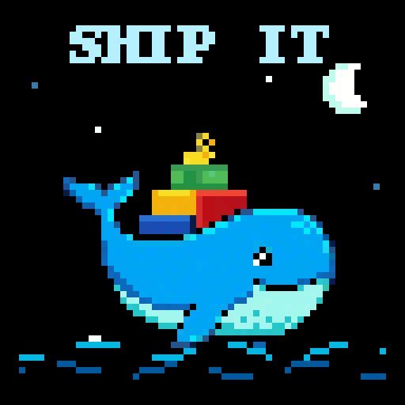
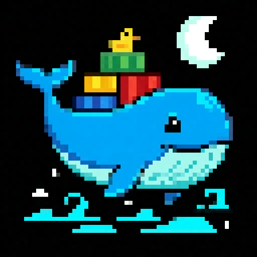
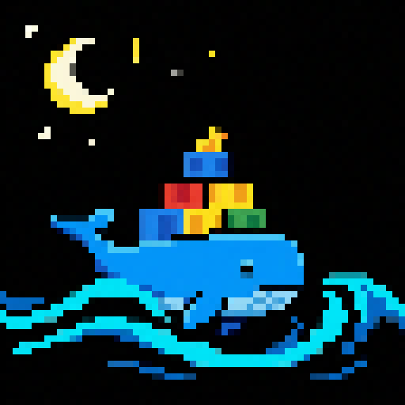

# Ship It 🐳 — Nano Banana × Docker × Devoxx

A six-second pixel animation for the [Devoxx Belgium Google Cloud raffle](https://devoxx-raffle.cloud.run/): a cheerful blue whale carries colorful shipping containers, a duck rides on top, and one container launches into an orbit before docking back on the whale.



**Submission file:** [ship-it-pro-64.gif](artwork/submission/ship-it-pro-64.gif). The preview above is enlarged to 512×512 for viewing. Upload the native **64×64 GIF**, rather than the preview.

## How we made it

1. **Directed the artwork.** We wrote [the complete generation prompt](prompts/docker-whale.txt) around a Docker-inspired whale, Google-colored shipping containers, true-black negative space, bright clustered colors, and chunky pixel shapes.
2. **Compared actual Google image models.** We generated the same prompt with Gemini 3.1 Flash Image, Nano Banana 2.1, and **Nano Banana Pro (`gemini-3-pro-image`)**. We selected Pro's expressive whale for this animation. This is a creative choice from these samples, not a claim that Pro wins every task.
3. **Preserved the generation evidence.** [The Pro generation record](generation/whale-pro-keyframe.json) includes the exact prompt, model ID, timestamp, response ID, and usage metadata. [The original Pro artwork](artwork/raw/whale-pro-keyframe.png) is included for reproduction. No Google credentials are stored in this repository.
4. **Separated the artwork into layers.** [build_whale.py](scripts/build_whale.py) extracts the whale, moon, and yellow container from the generated keyframe. It fits the whale to the native matrix and choreographs integer-pixel movement: whale bobbing, sea motion, star twinkles, and the container's orbit.
5. **Encoded the LED animation.** [animate.py](scripts/animate.py) exports 60 frames at 100 ms per frame, with a shared palette, no dithering, a true-black clamp, and infinite looping. It also generates an enlarged GIF and frame contact sheet for review.
6. **Checked the output.** We verified 64×64 dimensions, 60 decoded frames, six-second duration, an infinite loop, and file size below the raffle's 5 MB limit. The first export averages about 76% true-black pixels. These checks establish file properties, not a predicted contest score.

The animation is a first submission for obtaining real leaderboard feedback. It evokes Docker through the whale and shipping containers. Google colors connect the cargo to the ecosystem. More explicit Google Cloud deployment storytelling and Devoxx branding are possible revisions; they are not features of this first GIF.

## Artwork comparison

| Nano Banana Pro — chosen | Nano Banana 2.1 — alternative |
| --- | --- |
|  |  |

Model names are easy to mix up. **Gemini 3.8 Flash accepts image input but does not generate image output.** Nano Banana Pro is the dedicated `gemini-3-pro-image` model. Nano Banana 2.1 is the newer `gemini-nano-banana-2.1` image model. See [our dated model research](MODELS.md) and [Google's image generation documentation](https://docs.cloud.google.com/gemini-enterprise-agent-platform/models/capabilities/image-generation).

## Reproduce the submitted animation

Requires Python 3.14 and Pillow 12.3.0 for the validated environment. Other Python versions supported by this Pillow release may also work.

```sh
python3 -m venv .venv
.venv/bin/python -m pip install --index-url https://pypi.org/simple -r requirements.txt
chmod +x animate prepare pixoo
.venv/bin/python scripts/build_whale.py
```

This uses the included Pro keyframe. It does not call Google or require API credentials. The output is `artwork/submission/ship-it-pro-64.gif`.

### Generate new Nano Banana artwork

Requires the Google Cloud CLI, an authenticated Google account, and a project with billing/credits and the image-generation API enabled. Generation uses that project's quota and billing.

```sh
gcloud auth login
.venv/bin/python scripts/generate_google.py \
  --project YOUR_GOOGLE_CLOUD_PROJECT \
  --model gemini-3-pro-image \
  --prompt prompts/docker-whale.txt \
  --output artwork/raw/whale-pro-v2.png
```

The script obtains a short-lived token from your existing `gcloud` login and saves the artwork and a generation record. It refuses to overwrite an existing output. Use `--model gemini-nano-banana-2.1` for the newer image model. The layer extraction is calibrated to the included Pro keyframe; a new composition requires adjusting extraction rather than blindly replacing the source.

### Encode your own animation frames

```sh
./animate path/to/frames/*.png --name my-animation --duration 100
```

Use square images and zero-padded frame names (`000.png`, `001.png`, etc.). The encoder also accepts one animated GIF or a precisely aligned square sprite sheet with `--grid 4`. Existing GIF timing is replaced by the requested uniform duration. `./prepare` handles still-image preparation. See `--help` for options.

## Jixoo

We also cloned and built [glaforge/jixoo](https://github.com/glaforge/jixoo), a Java 21 Pixoo library/CLI, locally. Its 95 tests passed. **This GIF uses Pillow for preparation and animation; Jixoo is optional for playback on a physical display.** Its checkout and binaries are excluded from this repository.

```sh
git clone https://github.com/glaforge/jixoo.git vendor/jixoo
(cd vendor/jixoo && mvn package)
./pixoo --help
```

## Raffle entry

Upload [ship-it-pro-64.gif](artwork/submission/ship-it-pro-64.gif) and paste this public repository's URL into the raffle form's optional repository field. The site advertises 2× tickets for visuals and 3× for sharing the Nano Banana project repository. Verify the multiplier and success message on submission.

The site accepts up to three square visuals per entry, at most 5 MB each. A replacement submission overrides the active entry; the frontend reports a maximum of five submissions per day. Check the live site for current availability and terms.

Created with Google Nano Banana artwork and local animation code. Docker-inspired fan art; this project is not an official Docker, Google, or Devoxx project.
